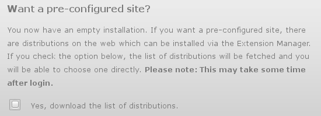
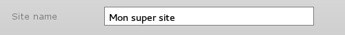

# Documentation

## Création des liens symboliques

Il est recommandé d’installer séparément la source (le « moteur ») de Typo3 et le site lui-même. Ainsi, il sera plus aisé de faire les mises à jour du moteur sans toucher aux fichiers propres au site.

Pour ce faire, et à titre d’exemple, on mettra à la racine de son serveur (le dossier `public_html` ou `www` ou `htdocs`), dans un dossier **source** le moteur de Typo3 (c-a-d l'archive zip ou tar.gz que l’on a téléchargée sur le site de Typo3 puis décompressée).  
Voici son contenu :

[les dossiers sont indiqués en **gras**, les fichiers en *italique*]

* `www`
	*  **source**
		* **typo3**
		* *_.htaccess*
		* *ChangeLog*
		* *composer.json*
		* *index.php*
		* *INSTALL.md*
		* *LICENSE.txt*
		* *NEWS.md*
		* *README.md*

Ensuite,

* il faudra faire des liens symboliques :
	- vers le répertoire **source**
	- vers le fichier *index.php*
	- vers le répertoire **typo3**
* et copier le fichier *_.htaccess* en le transformant en *.htaccess*

Exemple d’une installation multi-sites avec un site installé à la racine du serveur et un autre dans un dossier spécifique appelé **site2** :

[les liens symboliques sont en **gras** et suivis d’une flèche →]

* `www`
	* **source**
	* **typo3_src** → **source**
	* **index.php** → **source**/*index.php*
	* **typo3** → **source**/**typo3**
	* *.htaccess*
	* **site2**
		* **typo3_src** → **../source**
		* **index.php** → **../source**/*index.php*
		* **typo3** → **../source**/**typo3**
		* *.htaccess*

Sur un système du type `UNIX`, les commandes pour créer les liens symboliques et copier le htaccess sont :

* pour le site à la racine du serveur :
```bash
	cd www
	ln -s source typo3_src
	ln -s typo3_src/index.php index.php
	ln -s typo3_src/typo3 typo3
	cp typo3_src/_.htaccess .htaccess
```
* pour le « site2 » :
```bash
	cd www/site2
	ln -s ../source typo3_src
	ln -s typo3_src/index.php index.php
	ln -s typo3_src/typo3 typo3
	cp typo3_src/_.htaccess .htaccess
```

Pour créer des liens symboliques sur un système Windows ou sur un serveur mutualisé, voir les [annexes](annexes.md).


## Suite de l'installation

Après avoir créé ces liens symboliques, ouvrir dans un navigateur l’URL correspondant au dossier du futur site.  
Exemple, si le dossier en question s’appelle « Test_typo3 » et si on est en local, un URL possible serait :  
`http://locahost/Test_typo3`  
On arrive alors probablement sur le message suivant :


Il faut donc créer un fichier vide « FIRST_INSTALL » dans le répertoire (le nom de fichier ne doit pas avoir d’extension, par exemple du type .txt) pour pouvoir continuer l’installation.

Eventuellement, régler les droits pour permettre l’écriture dans ce répertoire, si un message de ce genre apparaît :


<a name="etape5">A l’étape 5</a> de l’installation, on ne coche pas la case permettant de télécharger une liste de distributions pré-configurées :



Ainsi, on partira réellement de « zéro ».

## Création de l’architecture du site

Lorsqu’on se loggue pour la première fois dans l’interface administrateur (le « backend »), le nom du site entré à l’étape 4 de l’installation :




